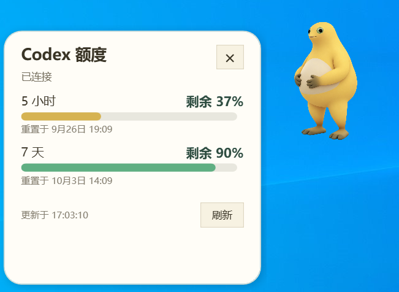

# TokenBaby
这个本人在一个无聊的下午完成的token工具，可以显示剩余的额度，同时加入的奶娃元素，希望大家喜欢，后续也会继续优化，目前项目只支持windows

一只常驻 Windows 桌面的黄色宠物，显示当前 ChatGPT 账号的 Codex 套餐剩余额度。TokenBaby 是社区项目，与 OpenAI 官方无隶属关系。

## 内容预览

| 低额度状态 | 点击后的捧腹大笑 |
| :---: | :---: |
|  |  |

额度面板：

## 功能

- 透明、始终置顶、可拖动；托盘菜单可隐藏、恢复和退出。
- 单击宠物展开额度面板，查看 5 小时与 7 天额度、重置时间及最近刷新时间。
- 由**5 小时剩余比例**决定宠物状态：≤20% 低落、>20% 且 ≤70% 平静、>70% 开心。
- 点击动作与状态对应：低额度擦泪、中额度回头看你、高额度捧腹大笑。待机时有轻微随机动作。
- 通过本机 Codex App Server 读取额度通知，并每分钟刷新。TokenBaby 不读取或保存登录令牌。

## 安装与运行

1. 使用 Windows 和 .NET Framework 4.8；安装 Codex 桌面版或 CLI，并在 Codex 中登录 **ChatGPT 账号**。
2. 从构建产物中解压 `TokenBaby-portable.zip`，保持 `TokenBaby.exe` 与 `assets` 文件夹在同一目录。
3. 运行 `TokenBaby.exe`。单击宠物可查看额度，右键宠物或托盘图标可打开菜单。

如果无法找到 `codex.exe`，可设置环境变量 `TOKENBABY_CODEX_PATH` 为其完整路径。TokenBaby 使用本机现有的 Codex 登录状态；API Key 登录不会返回所需的 ChatGPT 套餐额度。

## 许可证与素材

代码与仓库内素材按 [MIT 许可证](LICENSE) 发布。角色图片由 Codex imagegen 依据项目维护者提供、并确认可公开再发布的参考素材制作；原始参考照片未加入仓库。生成过程记录见 [assets/PROMPTS.md](assets/PROMPTS.md)。贡献新图片前请确认相同的再发布权利。

开发说明见 [CONTRIBUTING.md](CONTRIBUTING.md)。
